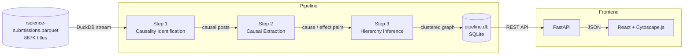
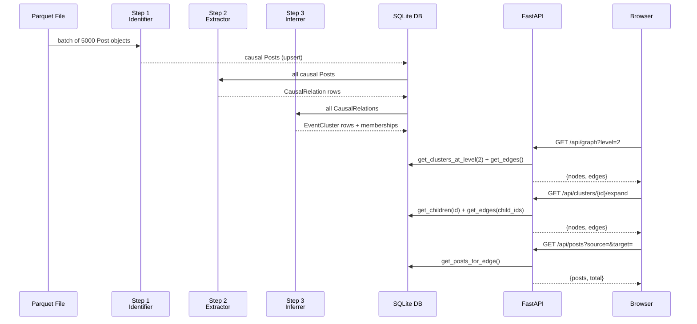
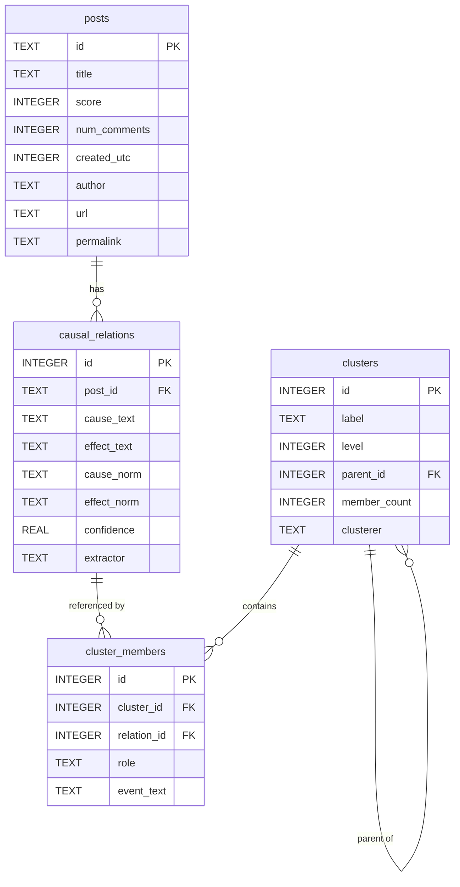
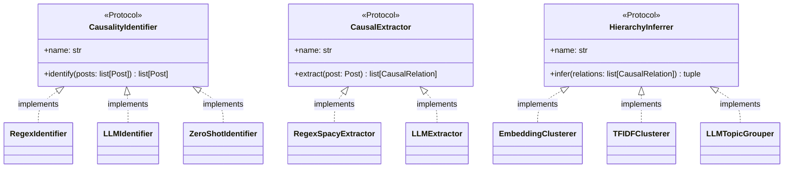
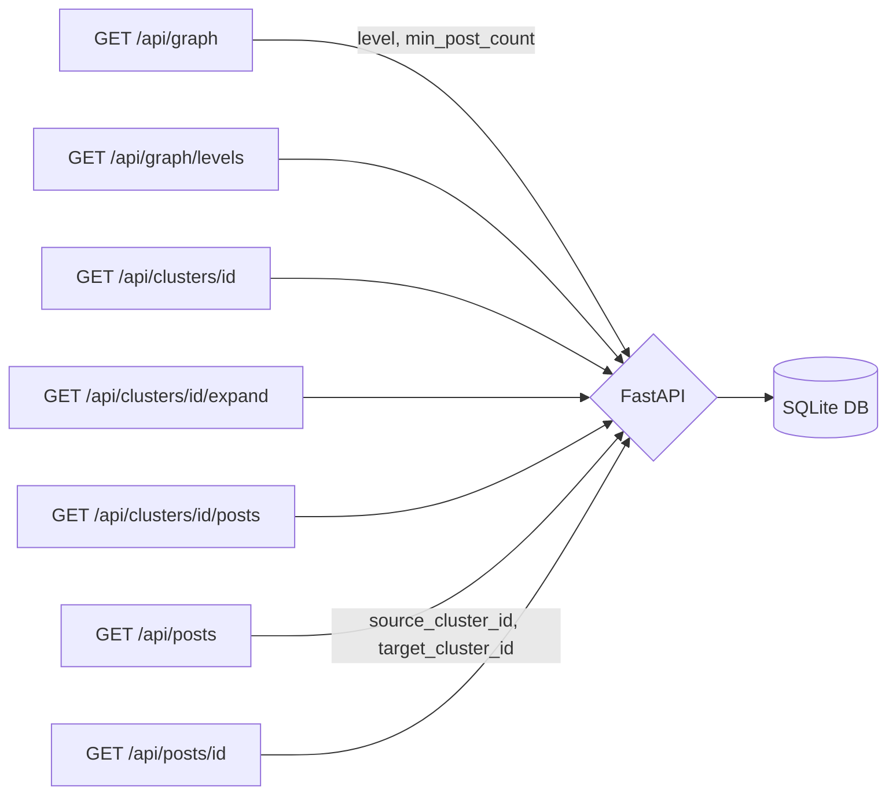
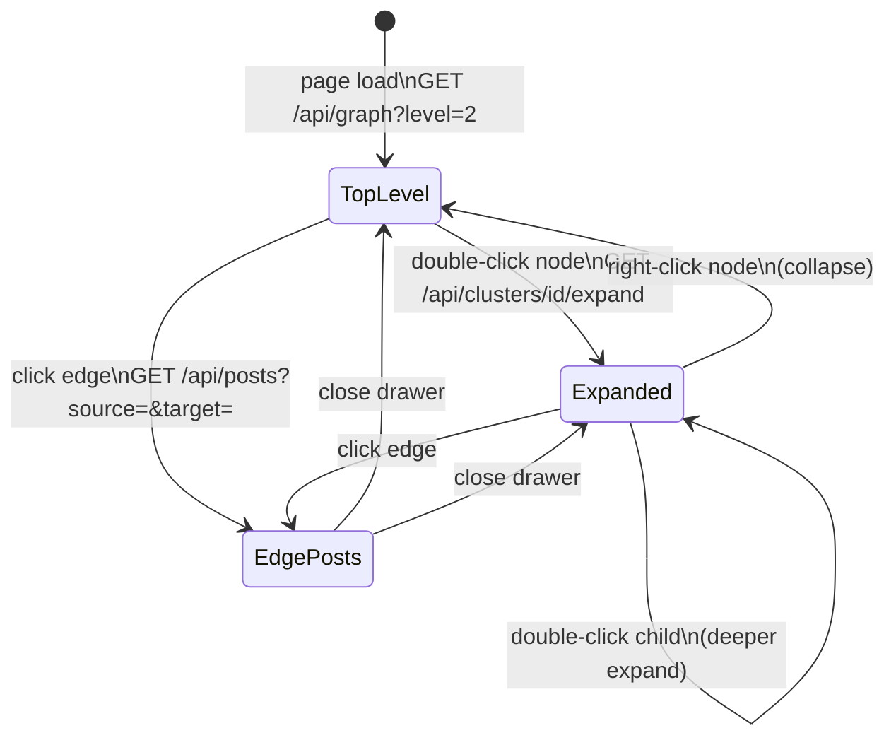

# Architecture

This document describes the architecture of the r/science causal relationship extraction and visualization pipeline.

## Overview

The project extracts causal claims from 867K Reddit r/science submission titles, structures them as a graph of events, and presents them in an interactive hierarchical visualization.

Each pipeline step is **independently pluggable**: the implementation is selected at runtime via `config.yaml` without any code changes.

---

## Component Responsibilities

| Component | Responsibility | Key Files |
|-----------|----------------|-----------|
| `ParquetReader` | Stream 867K rows from Parquet in batches | `pipeline/parquet_reader.py` |
| `CausalityIdentifier` | Filter titles to those expressing causality | `pipeline/step1_identification/` |
| `CausalExtractor` | Extract structured (cause, effect) pairs | `pipeline/step2_extraction/` |
| `HierarchyInferrer` | Cluster events into 3-level hierarchy | `pipeline/step3_hierarchy/` |
| `Database` | SQLite DAL — schema, writes, graph queries | `pipeline/db.py` |
| `Registry` | Load implementations from `config.yaml` | `pipeline/registry.py` |
| FastAPI app | Serve graph data over REST | `api/` |
| React + Cytoscape.js | Interactive hierarchical causal graph | `frontend/` |

---

## Data Flow

---

## Database Schema

The `graph_edges` VIEW joins `cluster_members` to produce aggregated cause→effect edges between clusters, used by all graph API endpoints.

---

## Pluggable Interfaces

Each pipeline step is defined as a Python `Protocol` (structural typing). Swap implementations by changing one line in `config.yaml`.

---

## Hierarchy Model

Events are organized into a 3-level tree. The frontend renders each level as Cytoscape.js compound nodes.

Directed edges between clusters represent extracted causal relationships; edge weight encodes post count.

---

## API Reference

All endpoints are read-only (`GET`). The API is served at `http://localhost:8000`.

| Endpoint | Parameters | Purpose |
|----------|------------|---------|
| `GET /api/graph` | `level`, `min_post_count` | Top-level nodes + edges at a given hierarchy level |
| `GET /api/graph/levels` | — | Available levels and cluster counts |
| `GET /api/clusters/{id}` | — | Cluster detail: children, top events, sample posts |
| `GET /api/clusters/{id}/expand` | `min_post_count` | Child nodes + intra-cluster edges (drill-down) |
| `GET /api/clusters/{id}/posts` | `limit`, `offset`, `sort` | Paginated posts in cluster |
| `GET /api/posts` | `source_cluster_id`, `target_cluster_id` | Posts for a cause→effect edge click |
| `GET /api/posts/{id}` | — | Single post with extracted causal pair |

---

## Frontend Interaction Model

The Cytoscape.js graph uses **compound nodes** to represent expanded clusters. When a user double-clicks a cluster node:

1. `GET /api/clusters/{id}/expand` fetches child nodes and intra-cluster edges.
2. Child nodes are added to the Cytoscape element set with `parent: "cluster-{id}"`.
3. The parent node becomes a compound container; Cytoscape re-runs the `fcose` layout.

Collapsing removes child elements and resets the parent to a regular node.
