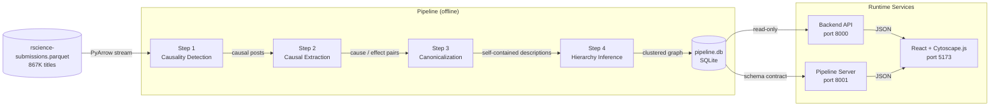
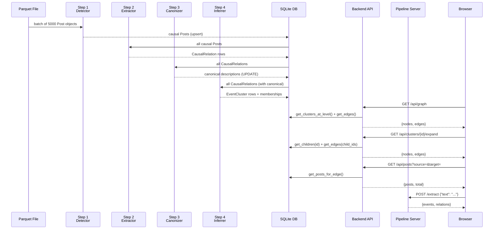
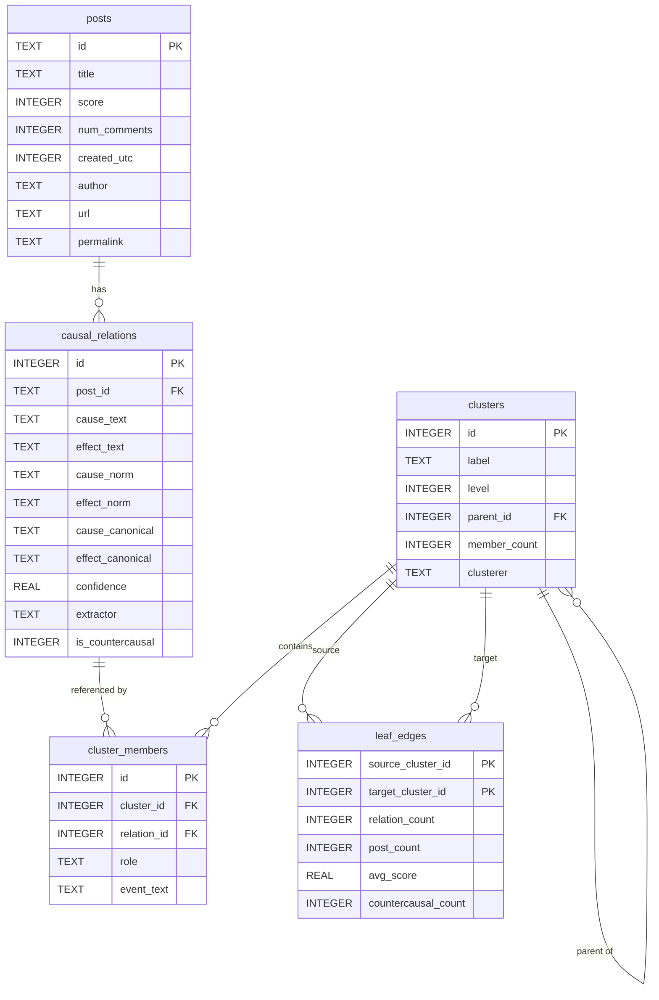
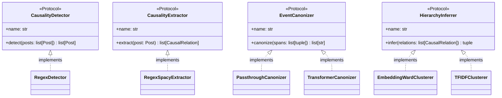
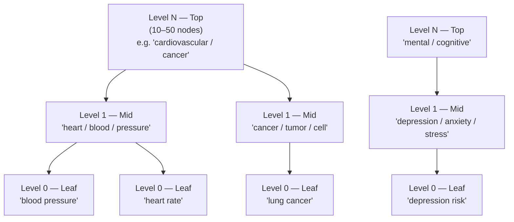
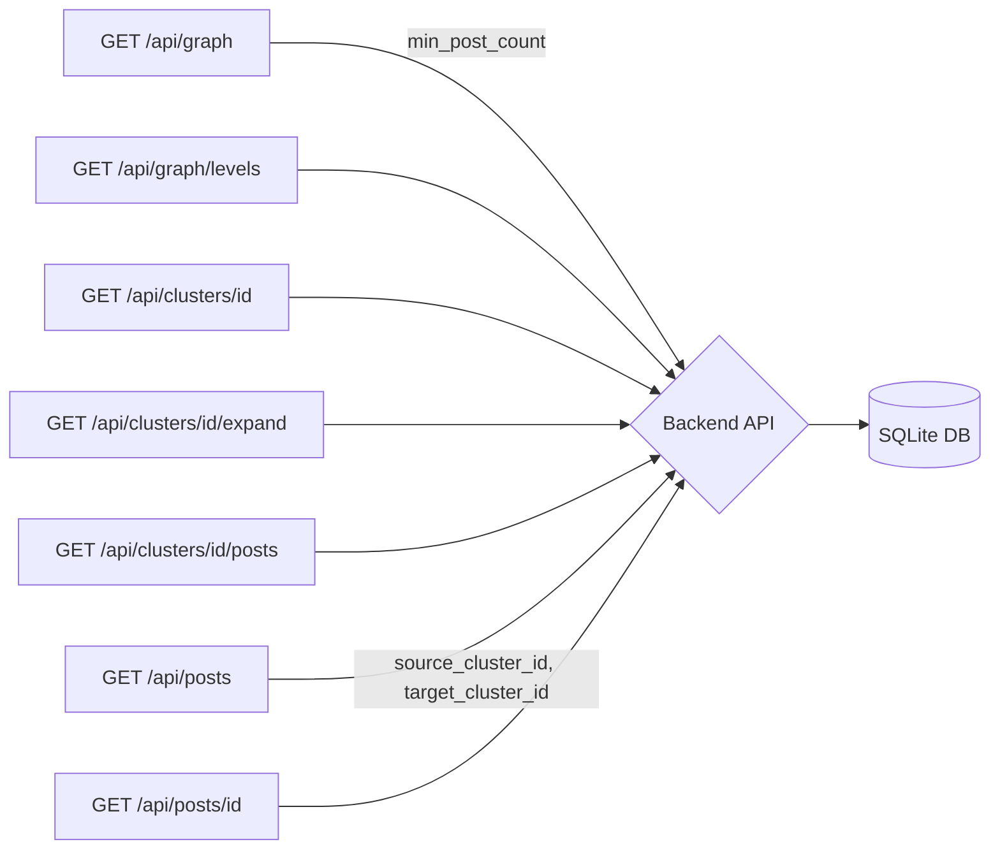
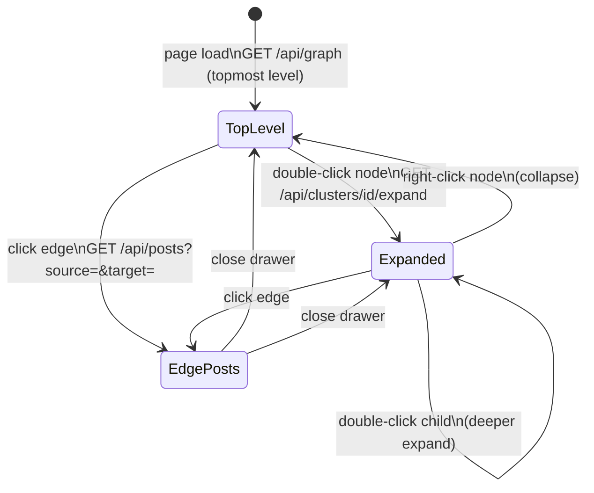

# Architecture

This document describes the architecture of the r/science causal relationship extraction and visualization pipeline.

## Overview

The project extracts causal claims from 867K Reddit r/science submission titles, structures them as a graph of events, and presents them in an interactive hierarchical visualization.

Each pipeline step is **independently pluggable**: the implementation is selected at runtime via `pipeline.yaml` without any code changes.

The backend API (`api/`) and the pipeline (`pipeline/`) share **no Python imports** — they are connected only through the SQLite database. See [graphformat.md](graphformat.md) for the schema contract.

---

## Component Responsibilities

| Component | Responsibility | Key Files |
|-----------|----------------|-----------|
| `ParquetReader` | Stream 867K rows from Parquet in batches | `pipeline/parquet_reader.py` |
| `CausalityDetector` | Filter titles to those expressing causality | `pipeline/step1_detection/` |
| `CausalityExtractor` | Extract structured (cause, effect) pairs | `pipeline/step2_extraction/` |
| `EventCanonizer` | Rewrite event spans into self-contained descriptions | `pipeline/step3_canonization/` |
| `HierarchyInferrer` | Cluster events into multi-level hierarchy | `pipeline/step4_hierarchy/` |
| `Database` (pipeline) | SQLite DAL — schema, writes, graph queries | `pipeline/db.py` |
| `GraphDatabase` (API) | Read-only SQLite access for graph queries | `api/db.py` |
| Backend API | Serve graph data over REST | `api/` |
| Pipeline Server | Per-step REST API for live text analysis | `pipeline/server.py` |
| React + Cytoscape.js | Interactive hierarchical causal graph | `frontend/` |

---

## Data Flow

---

## Database Schema

See [graphformat.md](graphformat.md) for the full schema specification.

---

## Pluggable Interfaces

Each pipeline step is defined as a Python `Protocol` (structural typing). Swap implementations by changing one line in `pipeline.yaml`.

---

## Hierarchy Model

Events are organized into a multi-level tree. The number of levels is configured via `n_clusters_per_level` in `pipeline.yaml` — the list length determines the number of levels. The frontend renders the topmost level on load and supports drill-down via double-click.

Directed edges between clusters represent extracted causal relationships; edge weight encodes post count. The frontend always starts at the topmost level (`MAX(level)`) and infers this automatically from the API.

---

## API Reference

### Backend API (port 8000) — read-only graph endpoints

| Endpoint | Parameters | Purpose |
|----------|------------|---------|
| `GET /api/graph` | `min_post_count` | Top-level nodes + edges at the topmost hierarchy level |
| `GET /api/graph/levels` | — | Available levels and cluster counts |
| `GET /api/clusters/{id}` | — | Cluster detail: children, top events, sample posts |
| `GET /api/clusters/{id}/expand` | `min_post_count` | Child nodes + intra-cluster edges (drill-down) |
| `GET /api/clusters/{id}/posts` | `limit`, `offset`, `sort` | Paginated posts in cluster |
| `GET /api/posts` | `source_cluster_id`, `target_cluster_id` | Posts for a cause→effect edge click |
| `GET /api/posts/{id}` | — | Single post with extracted causal pair |

### Pipeline Server (port 8001) — live text analysis

| Endpoint | Body | Purpose |
|----------|------|---------|
| `POST /detect` | `{"text": "..."}` | Classify text as causal (`is_causal: bool`) |
| `POST /extract` | `{"text": "..."}` | Extract events and relations with character spans |
| `GET /health` | — | Liveness check |

---

## Frontend Interaction Model

The Cytoscape.js graph uses **compound nodes** to represent expanded clusters. When a user double-clicks a cluster node:

1. `GET /api/clusters/{id}/expand` fetches child nodes and intra-cluster edges.
2. Child nodes are added to the Cytoscape element set with `parent: "cluster-{id}"`.
3. The parent node becomes a compound container; Cytoscape re-runs the layout.

Collapsing removes child elements and resets the parent to a regular node.

The graph layout algorithm can be changed in the Settings panel (gear icon). Available built-in options: `fcose`, `cose`, `breadthfirst`, `concentric`, `circle`.
