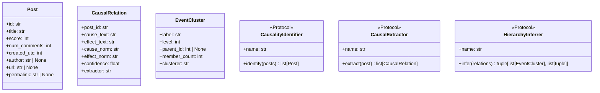

# Extending the Pipeline

## Adding a new implementation

Each pipeline step has a corresponding Python `Protocol` in `pipeline/protocols.py`. To add a new implementation:

### Example: new Step 1 identifier

**1. Create the class**

```python
# pipeline/step1_identification/my_identifier.py
from pipeline.protocols import CausalityIdentifier, Post

class MyIdentifier:
    def __init__(self, my_param: float = 0.5, **kwargs) -> None:
        self.threshold = my_param

    @property
    def name(self) -> str:
        return "my_identifier"

    def identify(self, posts: list[Post]) -> list[Post]:
        # Your logic here
        return [p for p in posts if self._is_causal(p.title)]

    def _is_causal(self, title: str) -> bool:
        ...
```

> [!IMPORTANT]
> Accept `**kwargs` in `__init__` so the registry can pass unrecognized config keys without errors.

**2. Register it**

In `pipeline/registry.py`, add an entry to `_STEP1_REGISTRY`:

```python
_STEP1_REGISTRY: dict[str, tuple[str, str]] = {
    ...
    "my_identifier": (
        "pipeline.step1_identification.my_identifier",
        "MyIdentifier",
    ),
}
```

**3. Configure it**

In `config.yaml`:

```yaml
pipeline:
  step1_identification:
    implementation: "my_identifier"
    my_param: 0.8
```

**4. Test it**

The registry validates Protocol conformance at load time using `isinstance()` on the `@runtime_checkable` Protocol. If your class is missing required methods, you'll get a `TypeError` immediately.

---

## Protocol reference



### `HierarchyInferrer.infer()` return value

```python
clusters: list[EventCluster]
memberships: list[tuple[int, int, str, str]]
# Each membership: (relation_index, cluster_index, role, event_text)
# - relation_index: position in the input `relations` list
# - cluster_index:  position in the returned `clusters` list
# - role:           'cause' or 'effect'
# - event_text:     the normalized event phrase
```

The `Database.insert_memberships()` method resolves these indices to actual DB row IDs.

---

## Adding a new API endpoint

1. Add a route function to an existing router in `api/routers/` or create a new router file.
2. Define the response model in `api/models.py`.
3. Add any new DB query methods to `pipeline/db.py`.
4. Include the new router in `api/main.py` via `app.include_router(...)`.
5. Add a test in `tests/test_api.py`.

---

## Frontend customization

The Cytoscape.js stylesheet is defined inline in `frontend/src/components/CausalGraph.tsx`. Node colors, edge widths, and fonts are all controlled there.

To change the graph layout, replace `fcose` with any Cytoscape layout extension:

```typescript
import cola from 'cytoscape-cola';
cytoscape.use(cola);

// In CausalGraph.tsx:
cy.layout({ name: 'cola', animate: true }).run();
```

Available compound-aware layouts: `fcose`, `cola`, `cose-bilkent`.
