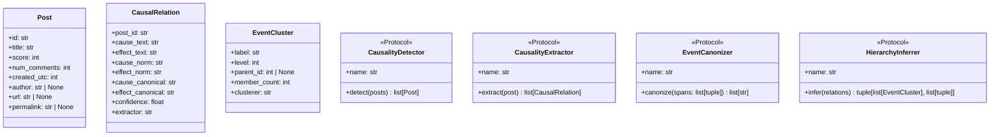

# Extending the Pipeline

## Adding a new implementation

Each pipeline step has a corresponding Python `Protocol` in `pipeline/protocols.py`. To add a new implementation:

### Example: new Step 1 detector

**1. Create the class**

```python
# pipeline/step1_detection/my_detector.py
from pipeline.protocols import CausalityDetector, Post

class MyDetector:
    def __init__(self, my_param: float = 0.5, **kwargs) -> None:
        self.threshold = my_param

    @property
    def name(self) -> str:
        return "my_detector"

    def detect(self, posts: list[Post]) -> list[Post]:
        # Your logic here
        return [p for p in posts if self._is_causal(p.title)]

    def _is_causal(self, title: str) -> bool:
        ...
```

> [!IMPORTANT]
> Accept `**kwargs` in `__init__` so the registry can pass unrecognized config keys without errors.

**2. Configure it**

In `pipeline.yaml`:

```yaml
step1_detection:
  implementation: "pipeline.step1_detection.my_detector.MyDetector"
  my_param: 0.8
```

**3. Test it**

The new implementation is automatically available in the pipeline server (`uvicorn pipeline.server:app`) without any changes — it uses the same `pipeline.yaml`.

---

### Example: new Step 3 canonizer

**1. Create the class**

```python
# pipeline/step3_canonization/my_canonizer.py
from pipeline.protocols import EventCanonizer

class MyCanonizer:
    def __init__(self, **kwargs) -> None:
        pass

    @property
    def name(self) -> str:
        return "my_canonizer"

    def canonize(self, spans: list[tuple[str, tuple[int, int]]]) -> list[str]:
        result = []
        for text, (start, end) in spans:
            raw_span = text[start:end]
            result.append(self._enrich(raw_span, text))
        return result
```

**2. Configure it** (same pattern as above, using the `step3_canonization` key in `pipeline.yaml`).

---

## Protocol reference



### `CausalRelation` fields

| Field | Set by | Purpose |
|-------|--------|---------|
| `cause_text` | Step 2 (Extractor) | Raw extracted span from title |
| `effect_text` | Step 2 (Extractor) | Raw extracted span from title |
| `cause_norm` | Step 2 (Extractor) | Lowercased/lemmatized, used as dedup key |
| `effect_norm` | Step 2 (Extractor) | Lowercased/lemmatized, used as dedup key |
| `cause_canonical` | Step 3 (Canonizer) | Self-contained description for clustering/display |
| `effect_canonical` | Step 3 (Canonizer) | Self-contained description for clustering/display |

Step 4 (Hierarchy) uses `cause_canonical`/`effect_canonical` (falling back to `cause_text`/`effect_text` or `cause_norm` if empty) as the text to embed or vectorize.

### `HierarchyInferrer.infer()` return value

```python
clusters: list[EventCluster]
memberships: list[tuple[int, int, str, str]]
# Each membership: (relation_index, cluster_index, role, event_text)
# - relation_index: position in the input `relations` list
# - cluster_index:  position in the returned `clusters` list
# - role:           'cause' or 'effect'
# - event_text:     the normalized event phrase (cause_norm / effect_norm)
```

The `Database.insert_memberships()` method resolves these indices to actual DB row IDs.

---

## Adding a new API endpoint

1. Add a route function to an existing router in `api/routers/` or create a new router file.
2. Define the response model in `api/models.py`.
3. Add any new DB query methods to `api/db.py` (`GraphDatabase` class).
4. Include the new router in `api/main.py` via `app.include_router(...)`.
5. Add a test in `tests/test_api.py`.

> [!NOTE]
> `api/db.py` is intentionally read-only and has no dependency on `pipeline/`. Keep it that way — all write operations belong in `pipeline/db.py`.

---

## Frontend customization

### Graph layout

The layout algorithm can be changed in the **Settings panel** (gear icon) at runtime — no code changes needed. Available built-in options:

| Algorithm | Notes |
|-----------|-------|
| `fcose` | Force-directed, compound-aware *(default)* |
| `cose` | Cytoscape built-in force-directed |
| `breadthfirst` | Tree layout, directed |
| `concentric` | Rings by connectivity |
| `circle` | Equal-radius circle |

To add a new layout algorithm (e.g. a Cytoscape extension), install the npm package, register it with `cytoscape.use(...)` in `CausalGraph.tsx`, add its name to the `LayoutAlgorithm` union in `types.ts`, and add a case to the `buildLayout()` function in `CausalGraph.tsx`.

### Styling

The Cytoscape.js stylesheet is defined inline in `frontend/src/components/CausalGraph.tsx`. Node colors, edge widths, and fonts are all controlled there.

### Post display

The `PostItem` component (`frontend/src/components/PostItem.tsx`) renders individual posts in both the edge detail drawer and the cluster detail sidebar. It accepts an optional `showSpans` prop to highlight cause/effect spans — this is controlled by the "Highlight event spans" toggle in Settings.
